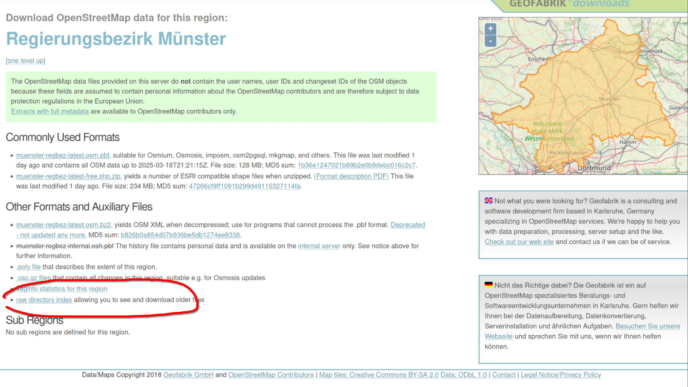
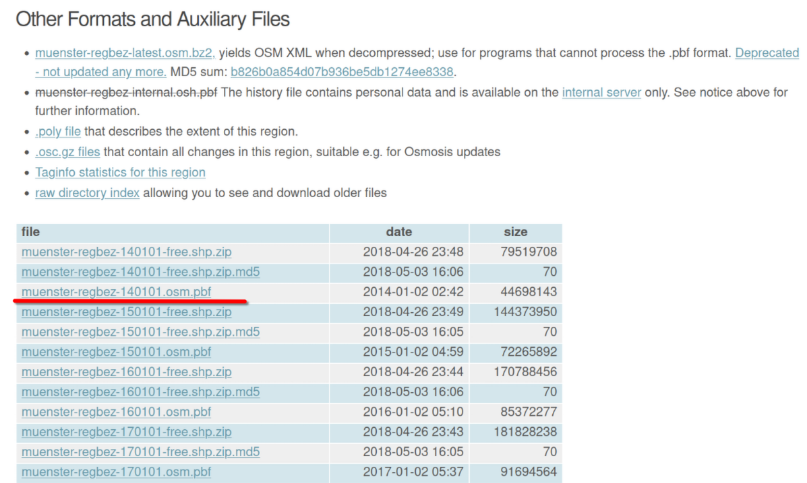
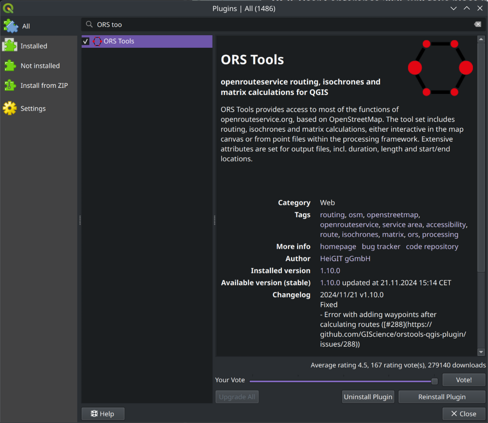
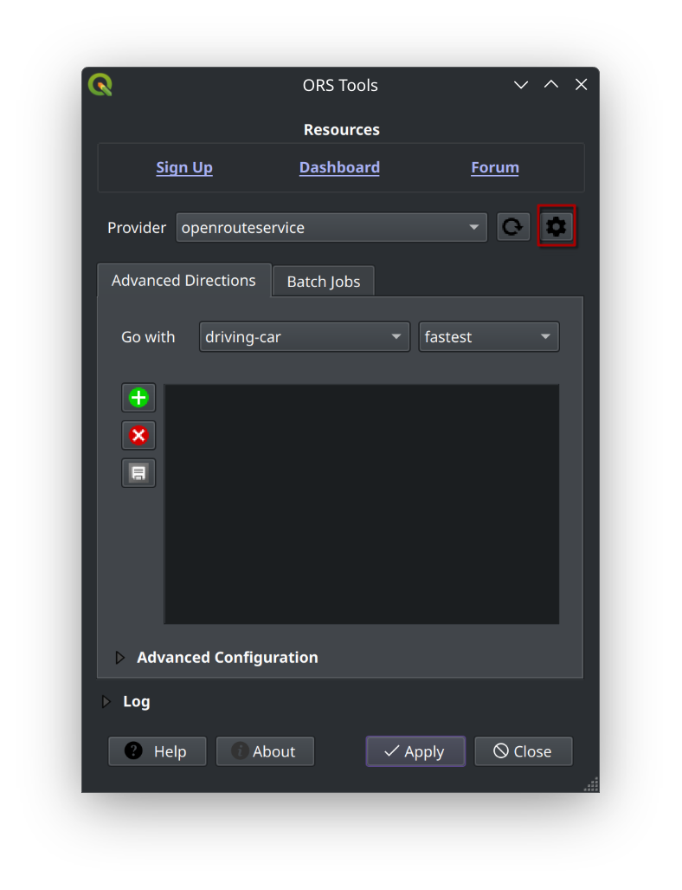
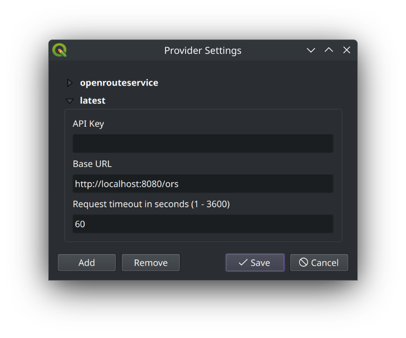
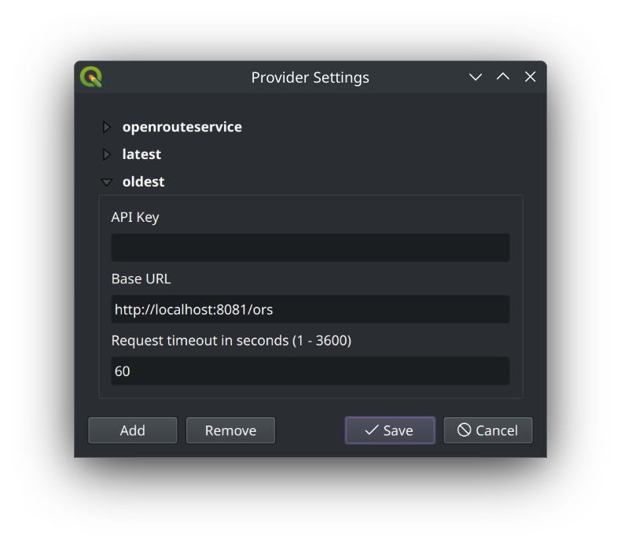
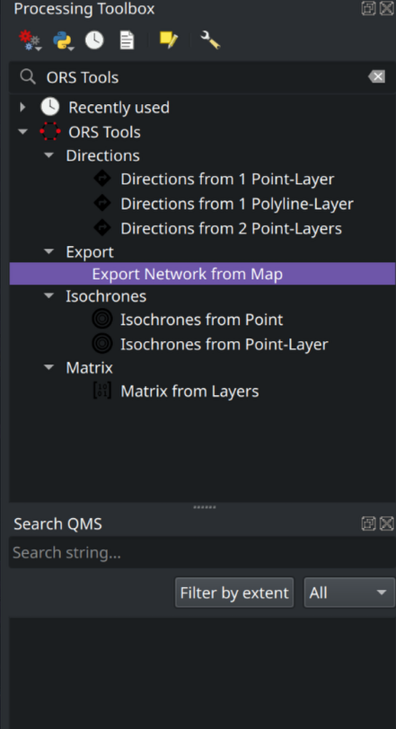
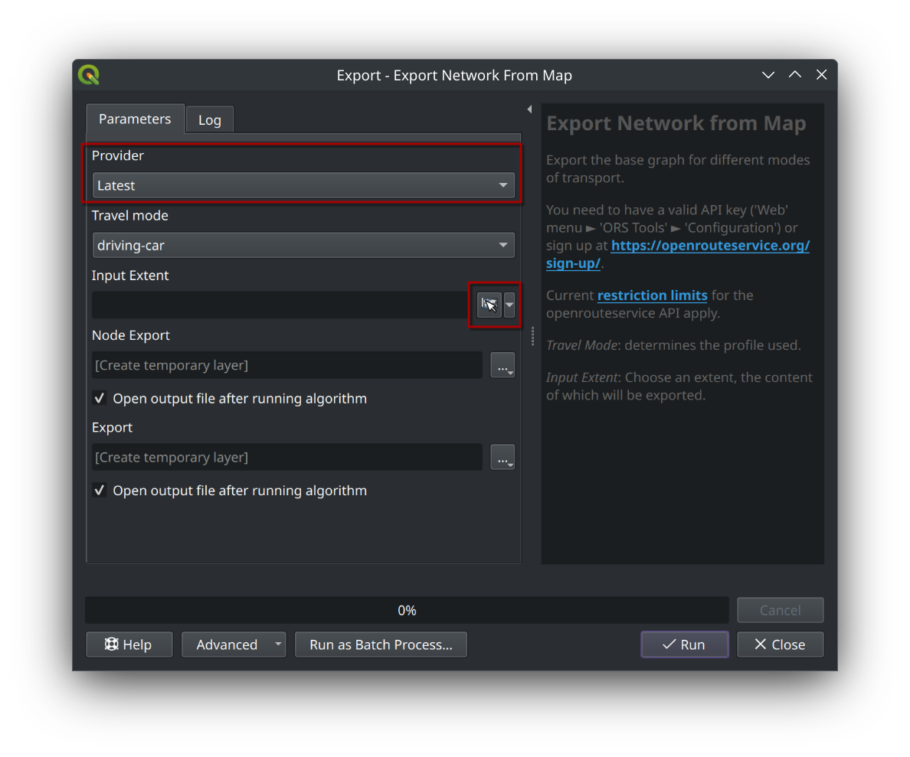

# Openrouteservice aufsetzen

## 1. Basisumgebung einrichten

### Anforderungen

- **Docker**: Container-Plattform für die ORS-Installation
- **curl**: Kommandozeilentool für HTTP-Anfragen
- **Linux oder macOS**: Betriebssysteme mit vollen Docker-Funktionen
- **Mindestens 4GB RAM**: Für die Grapherstellung empfohlen

### Arbeitsumgebung einrichten

Wir bereiten nun die Umgebung für den erfolgreichen Start eines Openrouteservice-Containers vor.

```bash
# Arbeitsverzeichnis erstellen
mkdir fossgis_workshop
cd fossgis_workshop

# Verzeichnis für ORS-Dateien erstellen
mkdir -p ors-docker-latest/files
```

### PBF-Datei herunterladen

Für den ersten Teil dieser Anleitung arbeiten wir mit zwei PBF-Dateien: Münster und Detmold.
Es können jederzeit andere PBF-Dateien von Geofabrik heruntergeladen werden: <https://download.geofabrik.de>

```bash
# Münster PBF-Datei herunterladen
curl -C - https://download.geofabrik.de/europe/germany/nordrhein-westfalen/muenster-regbez-latest.osm.pbf -o ors-docker-latest/files/muenster-regbez-latest.osm.pbf

# Detmold PBF-Datei herunterladen
curl -C - https://download.geofabrik.de/europe/germany/nordrhein-westfalen/detmold-regbez-latest.osm.pbf -o ors-docker-latest/files/detmold-regbez-latest.osm.pbf
```

**Hinweis zu curl-Optionen:**

- `-C -`: Ermöglicht das Fortsetzen eines unterbrochenen Downloads
- `-o`: Bestimmt den Namen der Ausgabedatei

## 2. Openrouteservice-Container mit Basis-Konfiguration und Münster PBF-Datei starten

### Konfigurationsdatei erstellen

Wir erstellen eine Basis-Konfigurationsdatei für Openrouteservice. 
Weitere Konfigurationsparameter können der [Dokumentation](https://giscience.github.io/openrouteservice/run-instance/configuration/engine/) entnommen werden.

```bash
# Konfigurationsdatei für Auto-Routing mit Münster-Daten erstellen
echo "ors.engine.profile_default.build.source_file=/home/ors/files/muenster-regbez-latest.osm.pbf" > ors_car_muenster_latest.env
echo "ors.engine.profiles.driving-car.enabled=true" >> ors_car_muenster_latest.env
```

**Wichtige Konfigurationsparameter:**

- `ors.engine.profile_default.build.source_file`: Pfad zur PBF-Datei im Container
- `ors.engine.profiles.driving-car.enabled`: Aktiviert das Profil für Autofahrer
- Weitere mögliche Profile: `cycling-regular`, `foot-walking`, `wheelchair` etc.

### Container starten

```bash
# Alten Container entfernen, falls vorhanden
docker rm -f ors-app || true

# Neuen Container starten
docker run -d \
  --name ors-app \
  -u $(id -u):$(id -g) \
  -p 8080:8082 \
  -v ./ors-docker-latest:/home/ors \
  -e CONTAINER_LOG_LEVEL=INFO \
  -e REBUILD_GRAPHS=true \
  -e XMS=1g \
  -e XMX=2g \
  --env-file ors_car_muenster_latest.env \
  openrouteservice/openrouteservice:latest

# Logs überwachen
docker logs -ft ors-app
```

**Erklärung wichtiger Docker-Parameter:**

- `-d`: Startet den Container im Hintergrund (detached mode)
- `-u $(id -u):$(id -g)`: Lässt den Container mit den Benutzerrechten des aktuellen Nutzers laufen
- `-p 8080:8082`: Leitet Port 8082 im Container auf Port 8080 des Hosts weiter
- `-v ./ors-docker-latest:/home/ors`: Bindet das lokale Verzeichnis im Container ein
- `-e REBUILD_GRAPHS=true`: Erzwingt Neuerstellung der Routing-Graphen
- `-e XMS=1g -e XMX=2g`: Setzt minimale und maximale Java-Heap-Größe

### API-Verfügbarkeit prüfen

Nachdem der Container gestartet wurde, kann die API unter `http://localhost:8080/ors` erreicht werden.

```bash
# Health-Endpunkt prüfen
curl http://localhost:8080/ors/v2/health

# Verfügbare Profile überprüfen
curl http://localhost:8080/ors/v2/status
```

Eine erfolgreiche Antwort sollte wie folgt aussehen:

```json
{"status":"ready"}
```

Wir überprüfen nun ebenfalls die verfügbaren Profile:

```bash
curl http://localhost:8080/ors/v2/status
```

Eine erfolgreiche Antwort sollte diverse Informationen über die konfigurierte Instanz enthalten, darunter auch die verfügbaren Profile:

```json
"profiles": {
    "driving-car": {
      "storages": {},
      "encoder_name": "driving-car",
      "encoded_values": [],
      "graph_build_date": "2025-03-19T17:10:29Z",
      "osm_date": "2025-03-18T21:21:15Z",
      "limits": {
        "maximum_distance": 100000,
        "maximum_waypoints": 50,
        "maximum_distance_dynamic_weights": 100000,
        "maximum_distance_avoid_areas": 100000
      }
    }
  }
```

## 3. Openrouteservice-Container mit zwei Profilen und Münster PBF-Datei starten

Nun erstellen wir eine Konfigurationsdatei, die zwei Profile aktiviert: `driving-car` und `cycling-regular`.

```bash
echo "ors.engine.profile_default.build.source_file=/home/ors/files/muenster-regbez-latest.osm.pbf" > ors_car_cycling_muenster.env
echo "ors.engine.profiles.driving-car.enabled=true" >> ors_car_cycling_muenster.env
echo "ors.engine.profiles.cycling-regular.enabled=true" >> ors_car_cycling_muenster.env
```

- Das erste `echo`-Kommando erstellt eine Datei `ors_car_cycling_muenster.env` und setzt den Pfad zur PBF-Datei für die Profile `driving-car` und `cycling-regular`.
- `ors.engine.profile_default.build.source_file` gibt den Pfad zur PBF-Datei an, die für die Berechnung der Routen verwendet wird.
- `ors.engine.profiles.driving-car.enabled` aktiviert das Profil für Autofahrer.
- `ors.engine.profiles.cycling-regular.enabled` aktiviert das Profil für Radfahrer.

Mit dem folgenden Befehl wird ein Openrouteservice-Container gestartet, der auf Port 8081 erreichbar ist und die PBF-Datei aus dem aktuellen Verzeichnis verwendet.

```bash
# Alten Container entfernen
docker rm -f ors-app || true
# Neuen Container starten
docker run -d \
  --name ors-app \
  -u $(id -u):$(id -g) \
  -p 8080:8082 \
  -v ./ors-docker-latest:/home/ors \
  -e CONTAINER_LOG_LEVEL=INFO \
  -e XMS=1g \
  -e XMX=2g \
  -e REBUILD_GRAPHS=true \
  --env-file ors_car_cycling_muenster.env \
  openrouteservice/openrouteservice:latest
# Logs überwachen
docker logs -ft ors-app
```

Nachdem der Container gestartet wurde, kann die API unter `http://localhost:8080/ors` erreicht werden.
Wir testen jetzt, ob der `health`-Endpunkt erreichbar ist und den erfolgreichen Start des Containers bestätigt.

```bash
curl http://localhost:8080/ors/v2/health
```

Eine erfolgreiche Antwort sollte wie folgt aussehen:

```json
{"status":"ready"}
```

Wir überprüfen nun ebenfalls die verfügbaren Profile:

```bash
curl http://localhost:8080/ors/v2/status
```

Eine erfolgreiche Antwort sollte diverse Informationen über die konfigurierte Instanz enthalten, darunter auch die verfügbaren Profile:

```json
"profiles": {
    "driving-car": {
      "storages": {},
      "encoder_name": "driving-car",
      "encoded_values": [],
      "graph_build_date": "2025-03-19T17:10:29Z",
      "osm_date": "2025-03-18T21:21:15Z",
      "limits": {
        "maximum_distance": 100000,
        "maximum_waypoints": 50,
        "maximum_distance_dynamic_weights": 100000,
        "maximum_distance_avoid_areas": 100000
      }
    },
    "cycling-regular": {
      "storages": { },
      "encoder_name": "cycling-regular",
      "encoded_values": [ ],
      "graph_build_date": "2025-03-19T17:11:10Z",
      "osm_date": "2025-03-18T21:21:15Z",
      "limits": {
        "maximum_distance": 100000,
        "maximum_waypoints": 50,
        "maximum_distance_dynamic_weights": 100000,
        "maximum_distance_avoid_areas": 100000
      }
    }
  }
```

## 4. Openrouteservice-Container mit zwei Profilen und unterschiedlichen PBF-Dateien starten

Nun erstellen wir eine Konfigurationsdatei, die zwei Profile aktiviert: `driving-car` und `cycling-regular` und unterschiedliche PBF-Dateien verwendet.

```bash
echo "ors.engine.profile_default.build.source_file=/home/ors/files/muenster-regbez-latest.osm.pbf" > ors_car_cycling_muenster_detmold.env
echo "ors.engine.profiles.driving-car.enabled=true" >> ors_car_cycling_muenster_detmold.env
echo "ors.engine.profiles.cycling-regular.enabled=true" >> ors_car_cycling_muenster_detmold.env
echo "ors.engine.profiles.cycling-regular.build.source_file=/home/ors/files/detmold-regbez-latest.osm.pbf" >> ors_car_cycling_muenster_detmold.env
```

- Das erste `echo`-Kommando erstellt eine Datei `ors_car_cycling_muenster.env` und setzt den Pfad zur PBF-Datei für die Profile `driving-car` und `cycling-regular`.
- `ors.engine.profile_default.build.source_file` gibt den Pfad zur PBF-Datei an, die für die Berechnung der Routen verwendet wird.
- `ors.engine.profiles.driving-car.enabled` aktiviert das Profil für Autofahrer.
- `ors.engine.profiles.cycling-regular.enabled` aktiviert das Profil für Radfahrer.
- `ors.engine.profiles.cycling-regular.build.source_file` gibt den Pfad zur PBF-Datei an, die für die Berechnung der Routen für das Profil `cycling-regular` verwendet wird.

Wichtig zu beachten ist, das erste Profil übernimmt die Standard-PBF-Datei, die für alle Profile verwendet wird und über `ors.engine.profile_default.build.source_file` definiert wird.
Das `cyclin-regular`-Profil verwendet eine eigene PBF-Datei, die über `ors.engine.profiles.cycling-regular.build.source_file` definiert wird. Diese überschreibt die `profile_default`-Konfiguration.

Mit dem folgenden Befehl wird ein Openrouteservice-Container gestartet, der auf Port 8081 erreichbar ist und die PBF-Datei aus dem aktuellen Verzeichnis verwendet.

```bash
# Alten Container entfernen
docker rm -f ors-app || true
# Neuen Container starten
docker run -d \
  --name ors-app \
  -u $(id -u):$(id -g) \
  -p 8080:8082 \
  -v ./ors-docker-latest:/home/ors \
  -e CONTAINER_LOG_LEVEL=INFO \
  -e XMS=1g \
  -e XMX=2g \
  -e REBUILD_GRAPHS=true \
  --env-file ors_car_cycling_muenster_detmold.env \
  openrouteservice/openrouteservice:latest
# Logs überwachen
docker logs -ft ors-app
```

Die Überprüfung der Profile und des `health`- und `status`-Endpunkts erfolgt analog zu den vorherigen Schritten.

## 5. Openrouteservice-Container mit historischen PBF-Dateien

**Limitationen**: Um die historischen Daten zu visualisieren, können wir QGIS und das `ORS-Tools`-Plugin verwenden.
Das `ORS-Tools`-Plugin ermöglicht es, Routen mit Openrouteservice zu berechnen und in QGIS anzuzeigen.
Die derzeitige Version erlaubt es noch nicht, andere als die Standardprofile zu verwenden (z.B. `car-historic`), aber wir können mit einem Workaround die historischen Daten visualisieren.
Das Feature wird in einer zukünftigen Version des Plugins verfügbar sein.

### 1. Container Setup mit Münster und Detmold PBF-Dateien

#### Historische PBF-Dateien herunterladen

Im folgenden Abschnitt werden wir einen Openrouteservice-Container mit historischen PBF-Dateien starten.

Zunächst schauen wir uns auf der Geofabrik-Website die verfügbaren PBF-Dateien an: <https://download.geofabrik.de/europe/germany/nordrhein-westfalen/muenster-regbez.html>.
Dort finden wir unter anderem historische PBF-Dateien, die wir für unsere Zwecke verwenden können.

Um zu der Übersicht mit den historischen PBF-Dateien zu gelangen, klicken wir auf den Link "raw directory index":


Dort wählen wir die älteste verfügbare PBF-Datei vom 02.01.2014 aus: `muenster-regbez-140101.osm.pbf`.


Nun laden wir die historische PBF-Datei herunter:

```bash
# Ordnerstruktur für historische und aktuelle Daten erstellen
mkdir -p ors-docker-historic/files ors-docker-latest/files
# Aktuelle Münster PBF-Datei herunterladen
curl -C - https://download.geofabrik.de/europe/germany/nordrhein-westfalen/muenster-regbez-latest.osm.pbf -o ors-docker-latest/files/muenster-regbez-latest.osm.pbf
# Historische Münster PBF-Datei herunterladen
curl -C - https://download.geofabrik.de/europe/germany/nordrhein-westfalen/muenster-regbez-140101.osm.pbf -o ors-docker-historic/files/muenster-regbez-140101.osm.pbf
```

#### Zwei Openrouteservice-Container mit unterschiedlichen PBF-Dateien konfigurieren

Wir erstellen zwei Konfigurationsdateien, die jeweils ein Profile `driving-car` aktivieren, aber unterschiedliche PBF-Dateien verwenden.

```bash
# Konfiguration mit aktuellem Münster PBF-File
echo "ors.engine.profiles.driving-car.build.source_file=/home/ors/files/muenster-regbez-latest.osm.pbf" > ors_car_muenster_latest.env
echo "ors.engine.profiles.driving-car.enabled=true" >> ors_car_muenster_latest.env
# Konfiguration mit historischem Münster PBF-File
echo "ors.engine.profiles.driving-car.build.source_file=/home/ors/files/muenster-regbez-140101.osm.pbf" > ors_car_historic_muenster.env
echo "ors.engine.profiles.driving-car.enabled=true" >> ors_car_historic_muenster.env
```

#### Zwei Openrouteservice-Container mit unterschiedlichen PBF-Dateien starten

Wir starten zwei Openrouteservice-Container, die jeweils auf Port 8080 (latest osm) und 8081 (historic osm) erreichbar sind und jeweils eine der Konfigurationsdateien verwenden.

```bash
# Alte Container entfernen
docker rm -f ors-app || true
docker rm -f ors-app-historic || true

# Neuen Container mit aktuellem Münster PBF-File starten
docker run -d \
  --name ors-app \
  -u $(id -u):$(id -g) \
  -p 8080:8082 \
  -v ./ors-docker-latest:/home/ors \
  -e CONTAINER_LOG_LEVEL=INFO \
  -e XMS=1g \
  -e XMX=2g \
  -e REBUILD_GRAPHS=true \
  --env-file ors_car_muenster_latest.env \
  openrouteservice/openrouteservice:latest

# Neuen Container mit historischem Münster PBF-File starten
docker run -d \
  --name ors-app-historic \
  -u $(id -u):$(id -g) \
  -p 8081:8082 \
  -v ./ors-docker-historic:/home/ors \
  -e CONTAINER_LOG_LEVEL=INFO \
  -e XMS=1g \
  -e XMX=2g \
  -e REBUILD_GRAPHS=true \
  --env-file ors_car_historic_muenster.env \
  openrouteservice/openrouteservice:latest

# Logs überwachen
docker logs -ft ors-app
docker logs -ft ors-app-historic
```

#### Zwischenstand

Wir haben nun zwei Openrouteservice-Container gestartet, die jeweils auf Port 8080 und 8081 erreichbar sind und unterschiedliche PBF-Dateien verwenden.
Wir können nun mit QGIS und dem `ORS-Tolls`-Plugin die historischen Daten visualisieren.

### 2. Visualisierung historischer Daten in QGIS

Wir können nun damit beginnen die historischen und aktuellen Daten in QGIS zu visualisieren und miteinander zu vergleichen.

#### ORS-Tools-Plugin installieren

Zunächst installieren wir das `ORS-Tools`-Plugin in QGIS.
Dazu öffnen wir QGIS und installieren die Erweiterung:



#### Lokale Openrouteservice-Instanz konfigurieren

Anschließend konfigurieren wir das `ORS-Tools`-Plugin, um die lokale Openrouteservice-Instanz zu verwenden.
Dazu öffnen wir die Einstellungen des Plugins und wählen die `Provider`-Option aus.

Dort fügen wir eine neue Konfiguration hinzu und geben die URLs der lokalen Openrouteservice-Instanz an.

Zunächst konfigurieren wir die Openrouteservice-Instanz mit dem aktuellen Münster PBF-File:
Dabei achten wir darauf, dass die URL wie folgt lautet: `http://localhost:8080/ors`.


Danach konfigurieren wir die Openrouteservice-Instanz mit dem historischen Münster PBF-File.
Dabei achten wir darauf, dass die URL wie folgt lautet: `http://localhost:8081/ors`.


Bei beiden Konfigurationen wird das Feld `API Key` leer gelassen, da wir uns mit eigenen Instanzen nicht authentifizieren müssen.

#### Exportieren und Visualisieren der Routing-Graphen

Wir können nun mit dem `ORS-Tools`-Plugin die lokalen Openrouteservice-Instanzen verwenden.
Zur besseren Veranschaulichung werden wir die Routing-Graphen exportieren und in QGIS visualisieren.

Zunächst wählen wir in der `Processing Toolbox` ⇾ `Export Network from Map`.



Dort wählen wir die gewünschte Openrouteservice-Instanz (latest) und das Profil (driving-car) aus, für das wir den Routing-Graphen exportieren möchten.



Mit der Bestätigung auf `Run` wird der Routing-Graph exportiert und in QGIS geladen.

Dies machen wir auch für die historische Openrouteservice-Instanz, in dem wir die entsprechenden Einstellungen vornehmen und `oldest`als Provder auswählen.
Mit erneuter Bestätigung auf `Run` wird der "alte" Routing-Graph exportiert und in QGIS geladen.

Durch unterschiedliches Styling ist es nun möglich, die historischen und aktuellen Daten miteinander zu vergleichen.


## 6. Zusammenfassung

Wir haben in diesem Tutorial gelernt, wie sich Openrouteservice-Container mit unterschiedlichen PBF-Dateien und Profilen starten lassen.
Dabei haben wir uns auf die Konfiguration von Profilen für Autofahrer und Radfahrer konzentriert.
Zudem haben wir gelernt, wie historische PBF-Dateien verwendet und mit QGIS visualisiert werden können.

## 7. Aufräumen und Ressourcen freigeben

Nach Abschluss des Workshops sollten Sie die Docker-Container stoppen und entfernen sowie nicht mehr benötigte Dateien löschen, um Speicherplatz freizugeben.

### Container stoppen und entfernen

```bash
# Alle laufenden ORS-Container anzeigen
docker ps -a | grep ors-app

# Container stoppen und entfernen
docker stop ors-app ors-app-historic
docker rm ors-app ors-app-historic
```

### Dateien und Verzeichnisse aufräumen

Die heruntergeladenen PBF-Dateien und erstellten Graphen können je nach Region mehrere Gigabyte Speicherplatz belegen.

```bash
# Größe der ORS-Verzeichnisse anzeigen
du -sh ./ors-docker-*

# Optionaler Schritt: Verzeichnisse löschen, wenn nicht mehr benötigt
rm -rf ./ors-docker-latest ./ors-docker-historic
rm -f ors_*.env
```
