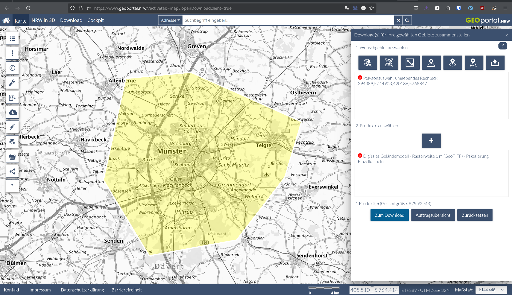

# OSM-Transform - PBF-Dateien anreichern und filtern

## 1. Einführung

OSM-Transform ermöglicht es, OpenStreetMap-Daten (PBF-Dateien) zu filtern und mit zusätzlichen Informationen anzureichern.
Ziel von OSM-Transform ist, die OSM-Daten für die Verwendung in Routing-Engines wie openrouteservice (ORS) vorzubereiten und zu optimieren.

Zu den Hauptfunktionen gehören:

- **Filtern** von PBF-Dateien nach geografischen Gebieten
- **Anreicherung** mit Höhendaten (DEM - Digital Elevation Model)
- **Anreicherung** mit Ländergrenzen und administrativen Grenzen
- **Optimierung** der Daten für nachfolgende Verarbeitungsschritte mit ORS

## 2. Voraussetzungen

- **Docker**: Container-Plattform für die OSM-Transform-Installation
- **curl**: Kommandozeilentool für HTTP-Anfragen
- **Linux oder macOS**: Betriebssysteme mit vollen Docker-Funktionen

## 3. Arbeitsumgebung einrichten

### Verzeichnisstruktur erstellen

Wir erstellen zunächst eine geeignete Verzeichnisstruktur für unsere Daten:

```bash
mkdir -p ./osm-transform/data/osm ./osm-transform/data/elevation ./osm-transform/data/output
```

### PBF-Dateien herunterladen

Für diesen Workshop benötigen wir eine OSM-Datei.
Wir verwenden als Beispiel erneut die Münster-Region:

```bash
# Münster PBF-Datei herunterladen
curl -C - https://download.geofabrik.de/europe/germany/nordrhein-westfalen/muenster-regbez-latest.osm.pbf -o ./osm-transform/data/osm/muenster-regbez-latest.osm.pbf
```

## 4. OSM-Transform mit Docker ausführen

### Basisbefehl

Der grundlegende Docker-Befehl zum Ausführen von OSM-Transform ist wie folgt:

```bash
docker run --rm \
    -v ./osm-transform/data/osm:/app/osm \
    -v ./osm-transform/data/output:/app/out \
    heigit/osm-transform:latest \
    -i /app/osm/muenster-regbez-latest.osm.pbf \
    -o /app/out/muenster.ot.pbf \
    -vvv
```

### Erklärung der Parameter

- **Docker-Optionen:**
  - `--rm`: Container nach Ausführung entfernen.
  - `-v ./osm-transform/data/osm:/app/osm`: Einbinden des lokalen OSM-Verzeichnisses.
  - `-v ./osm-transform/data/output:/app/out`: Einbinden des Ausgabeverzeichnisses.

- **OSM-Transform-Parameter:**
  - `-i /app/osm/muenster-regbez-latest.osm.pbf`: Eingabe-PBF-Datei.
  - `-o /app/out/muenster.ot.pbf`: Ausgabe-PBF-Datei.
  - `-vvv`: Ausführliche Protokollierung (sehr detailliert).

### Ergebnis überprüfen

- Die Ausgabe enthält Zusammenfassung der Verarbeitungsschritte und eine Erfolgsmeldung.
- `ls -lh ./osm-transform/**/*.pbf` zeigt die Größe der PBF-Dateien an. Gut, um diese vor und nach der Verarbeitung zu vergleichen.

Wie Sie sehen können wurde die Anzahl der Nodes 13 auf 2 Millionen und Anzahl der Ways 2 Millionen 450000 reduziert.
Dies ist ein wichtiger Schritt zur Optimierung der Daten für die Verwendung in Routing-Engines.
Je weniger Daten gelesen und verarbeitet werden müssen, desto schneller ist die Erstellung des Routing-Graphens.

## 5. Fortgeschrittene Konfiguration

### PBF-Dateien mit Höheninformationen anreichern

Für die Anreicherung mit Höhendaten benötigen wir hochauflösende DGM-Dateien.
Verwendet werden können alle im GeoTIFF-Format vorliegenden Höhendaten.

#### Anleitung zum Herunterladen der Höhendaten vom Geoportal NRW

```bash
# Verzeichnis für Höhendaten erstellen
mkdir -p ./osm-transform/data/elevation/
```

In diesem Beispiel verwenden wir das Geoportal NRW, um Höhendaten für die Münster-Region herunterzuladen:

1. Besuchen Sie die Website: [https://www.geoportal.nrw/?activetab=map](https://www.geoportal.nrw/?activetab=map)
2. Klicken Sie in der Menüleiste auf "Download"
3. Zeichnen Sie das gewünschte Gebiet auf der Karte auf. Beispiel: Münster.
4. Wählen Sie anschließend bei Produkten "Digitales Geländemodell - Rasterweite 1 m (GeoTIFF) - Paketierung: Einzelkacheln" aus.
5. Beim Klick auf "Zum Download" wird ein ZIP-Archiv heruntergeladen.
6. Entpacken Sie das ZIP-Archiv und verschieben Sie die enthaltenen GeoTIFF-Dateien in das Verzeichnis `./osm-transform/data/elevation/`.



```bash
# Entpacken und verschieben (Beispiel)
unzip -o ~/Downloads/dgm1_tiff_kacheln.zip -d ./osm-transform/data/elevation/
```

#### OSM-Daten mit Höheninformationen anreichern und Ways splitten

```bash
docker run --rm \
    -v ./osm-transform/data/osm:/app/osm \
    -v ./osm-transform/data/elevation:/app/elevation \
    -v ./osm-transform/data/output:/app/out \
    heigit/osm-transform:latest \
    -i /app/osm/muenster-regbez-latest.osm.pbf \
    -o /app/out/muenster.ot.pbf \
    -e '/app/elevation/*.tif' \
    -w \
    -vvv
```

- `-v ./osm-transform/data/elevation:/app/elevation`: Einbinden des Höhendatenverzeichnisses.
- `-e '/app/elevation/*.tif'`: Regex-Muster für Höhendateien.
- `-w`: Aktiviert das Way-Splitting für große Dateien.

Der Terminal-Output zeigt die Anzahl der Ways, die aufgeteilt wurden, und die Anzahl der Höheninformationen, die hinzugefügt wurden.

## 6. Ergebnisse prüfen

Nach der Verarbeitung können Sie die neue PBF-Datei überprüfen:

```bash
# Beispiel mit osmium
docker run --rm -v ./osm-transform/data/output:/data iboates/osmium:latest fileinfo /data/muenster.ot.pbf
```

Alternativ können Sie die Datei in QGIS öffnen. Dies ermöglicht eine visuelle Überprüfung der Daten.

## 7. Integration mit dem ORS

Die mit OSM-Transform verarbeiteten PBF-Dateien sind ideal für die Verwendung mit ORS, da sie bereits Höheninformationen enthalten, die Ways aufgeteilt und die Dateien gefiltert sind. Die reduzierte Dateigröße ermöglicht eine schnellere Verarbeitung.

### Beispiel: Verarbeitete PBF-Datei mit dem ORS verwenden

```bash
# Stellen Sie sicher, dass die neue PBF-Datei im richtigen Verzeichnis ist
cp ./osm-transform/data/output/muenster.ot.pbf ./ors-docker-latest/files/

# Passen Sie die docker-compose.yml an, um auf die neue Datei zu verweisen
# ORS_ENGINE_PROFILES_DRIVING_CAR_BUILD_SOURCE_FILE=/home/ors/files/muenster.ot.pbf

# Starten Sie den ORS
docker-compose up ors-app -d
```

## 8. Aufräumen und Ressourcen freigeben

Nach Abschluss des Workshops sollten Sie nicht mehr benötigte Dateien löschen, um Speicherplatz freizugeben:

```bash
# Optional: Temporäre Dateien löschen
rm -rf ./osm-transform/
```

## 9. Zusammenfassung

In diesem Tutorial haben Sie gelernt:

- Wie Sie OSM-Transform mit Docker einrichten und ausführen.
- Wie Sie PBF-Dateien mit Höhendaten anreichern.
- Wie Sie Ways splitten, die mehrere Höheninformationen enthalten.
- Wie Sie die Ergebnisse mit anderen Tools wie QGIS oder den ORS integrieren können.

Die verarbeiteten PBF-Dateien können nun für verschiedene Anwendungen verwendet werden, von der Routenberechnung bis hin zur räumlichen Analyse.
